# Finto — Google Cloud infrastructure

Live snapshot from `gcloud` (project `finto-477904`). Regenerate when the stack changes.

## Project

| Field | Value |
|--------|--------|
| **Project ID** | `finto-477904` |
| **Project name** | `finto` |
| **Project number** | `933094822357` |
| **Lifecycle** | `ACTIVE` |
| **Created** | `2025-11-11T04:08:09Z` |

## Primary workloads (running / in use)

| Area | What exists |
|------|----------------|
| **Cloud Run** | One service: **`finto-service`** in **`us-central1`**. Status **Ready**. Public URL: `https://finto-service-yn3hkiazaq-uc.a.run.app` (also `https://finto-service-933094822357.us-central1.run.app`). Container port **8000**, **512Mi** / **1** CPU, timeout **60s**, max instances **1**, unauthenticated ingress. Runtime service account: **`run-runtime@finto-477904.iam.gserviceaccount.com`**. Revisions deployed by **`cb-build@finto-477904.iam.gserviceaccount.com`**. |
| **Cloud Build** | Trigger **`finto-trigger`** (`5e84e0db-f5b7-4c28-be6e-0a38a2e70f55`). **GitHub** `deepjyotk/finto` — fires on **push of tags** matching `^v\d+\.\d+\.\d+$`. Uses build service account **`cb-build@finto-477904.iam.gserviceaccount.com`**. Build logs: included with status. |
| **Artifact Registry** | Repository **`apps`** (`DOCKER`) in **`us-central1`** — images for the Cloud Run service (e.g. `us-central1-docker.pkg.dev/finto-477904/apps/finto-service:<tag>`). |
| **Secret Manager** | Used by Cloud Run for env at runtime (**secret names only** — see below). |
| **Observability** | **Cloud Logging**, **Cloud Monitoring**, **Cloud Trace** APIs are enabled (standard for Run / Build). |
| **Cloud Scheduler** | Job **`daily-price-bars-1d`** in **`us-central1`**. Triggers a **public HTTP `POST`** to [`/api/v1/cron-jobs/daily/`](https://finto-service-yn3hkiazaq-uc.a.run.app/api/v1/cron-jobs/daily/) (daily price-bars refresh). **No OIDC / OAuth** on the HTTP target — this matches a **public** Cloud Run route (the service allows unauthenticated ingress). **Permissions:** a plain HTTPS request does not use `roles/run.invoker`; only **authenticated** (IAM) or **OIDC** targets need a caller identity. |

CI/CD pipeline behavior is defined in-repo at [`finto/cloudbuild.yaml`](../../cloudbuild.yaml) (Docker build → push to Artifact Registry → `gcloud run deploy` with `--set-secrets` / env).

## Other GCP surface (enabled APIs / not used here)

**Enabled service APIs** (abridged; full list from `gcloud services list --enabled` at capture time): Artifact Registry, BigQuery family, Cloud Build, Cloud Deploy, Cloud Run, Cloud Trace, Container Registry, IAM, Logging, Monitoring, Pub/Sub, Secret Manager, Storage (JSON + component), Sheets, Datastore component, plus supporting/Google-default services (e.g. `cloudapis.googleapis.com`, Service Usage, Recommender, etc.).

**Checked, not present or not applicable for this doc:**

- **Cloud Storage (buckets)**: `gcloud storage buckets list` returned **no buckets** for this project (empty list).
- **Cloud SQL**: Admin API not enabled; no instances listed via `gcloud sql instances list`.

### Cloud Scheduler (verified via `gcloud` MCP / `gcloud scheduler jobs describe`)

| Field | Value |
|--------|--------|
| **Resource name** | `projects/finto-477904/locations/us-central1/jobs/daily-price-bars-1d` |
| **State** | `ENABLED` |
| **Schedule (cron)** | `30 10 * * 1-5` |
| **Time zone** | `Asia/Kolkata` |
| **When it runs** | Weekdays at **10:30** in `Asia/Kolkata` (per cron: minute 30, hour 10, Mon–Fri). `scheduleTime` on describe was `2026-04-27T05:00:00Z` (next run as of last describe). |
| **HTTP method** | `POST` |
| **Target URL** | `https://finto-service-yn3hkiazaq-uc.a.run.app/api/v1/cron-jobs/daily/` |
| **Request auth (Scheduler → URL)** | **Unauthenticated** — `httpTarget` has **no** `oidcToken` and **no** `oauthToken` (public URL + public route). |
| **Attempt deadline** | `180s` |

**Note:** If the product goal is **16:00 IST** instead, the cron would need a different `hour` (e.g. `0 16 * * 1-5` for 16:00) — the deployed string above is what `gcloud` currently has.

Database connectivity for the app is via **`DATABASE_URL`** in Secret Manager (hosting provider is outside this GCP inventory).

## Architecture (high level)

```mermaid
flowchart TB
  subgraph Source
    GH["GitHub: deepjyotk/finto"]
    TAG["Release tag v*.*.*"]
  end

  subgraph GCP["GCP project finto-477904"]
    CB["Cloud Build\n(trigger: finto-trigger)"]
    AR["Artifact Registry\nus-central1 / apps\nfinto-service image"]
    CR["Cloud Run\nfinto-service\nus-central1"]
    SCH["Cloud Scheduler\ndaily-price-bars-1d"]
    SM["Secret Manager\n(latest versions)"]
    LOG["Logging / Monitoring / Trace"]
  end

  GH --> TAG
  TAG --> CB
  CB --> AR
  CB --> CR
  SM --> CR
  SCH -->|"POST /api/v1/cron-jobs/daily/"| CR
  CR --> LOG
```

**CI/CD flow in words:** pushing a SemVer **git tag** on the connected GitHub repo starts **Cloud Build**, which builds the Docker image, pushes it to **Artifact Registry**, then deploys **Cloud Run** with secrets mounted from **Secret Manager**. **Cloud Scheduler** sends a scheduled **POST** to the public cron route for daily `price_bars_1d` refresh. Other runtime traffic hits **Cloud Run**; telemetry goes to **Logging / Monitoring / Trace**.

## Secret Manager — secret IDs only (no values)

These are **resource names** in GCP; values are never stored in this wiki.

| Secret ID |
|-----------|
| `ANTHROPIC_API_KEY` |
| `DATABASE_URL` |
| `GOOGLE_API_KEY` |
| `GOOGLE_CLIENT_ID` |
| `HF_TOKEN` |
| `LANGSMITH_API_KEY` |
| `LANGSMITH_ENDPOINT` |
| `LANGSMITH_PROJECT` |
| `LANGSMITH_TRACING` |
| `NEWS_MODEL` |
| `OPENAI_API_KEY` |
| `PINECONE_API_KEY` |
| `PORTFOLIO_MODEL` |
| `ROUTER_MODEL` |
| `SECRET_KEY` |
| `SENDGRID_API_KEY` |
| `SENDGRID_FROM_EMAIL` |
| `SENDGRID_FROM_NAME` |
| `TAVILY_API_KEY` |
| `THESYS_API_KEY` |
| `THESYS_BASE_URL` |
| `THESYS_ENABLED` |
| `THESYS_MODEL` |
| `WA_APP_SECRET` |
| `WA_PHONE_NUMBER_ID` |
| `WA_SENDER_E164` |
| `WA_USER_OR_SYSTEM_TOKEN` |
| `WA_VERIFY_TOKEN` |

**Note:** The live Cloud Run revision mounts a subset of these as env vars (see `finto/cloudbuild.yaml` `--set-secrets`). **`HF_TOKEN`** exists in Secret Manager but is **not** listed in that deploy step; align deploy config if the app should read it at runtime.
