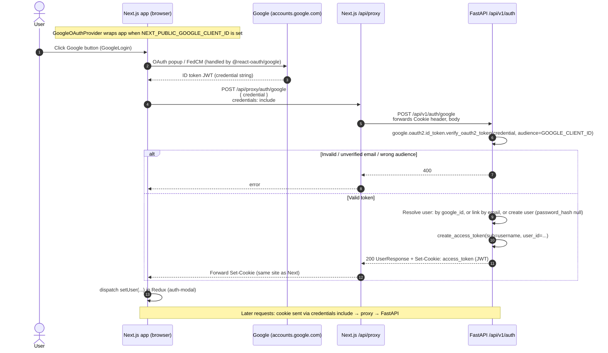
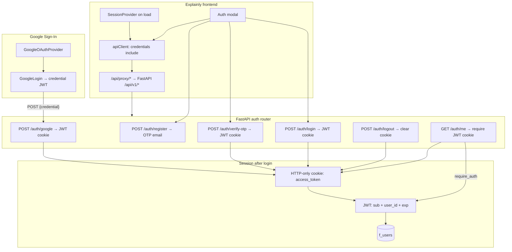

```mermaid
sequenceDiagram
  autonumber
  actor User
  participant Browser as Next.js app (browser)
  participant G as Google (accounts.google.com)
  participant Proxy as Next.js /api/proxy
  participant API as FastAPI /api/v1/auth

  Note over Browser: GoogleOAuthProvider wraps app when NEXT_PUBLIC_GOOGLE_CLIENT_ID is set
  User->>Browser: Click Google button (GoogleLogin)
  Browser->>G: OAuth popup / FedCM (handled by @react-oauth/google)
  G-->>Browser: ID token JWT (credential string)

  Browser->>Proxy: POST /api/proxy/auth/google<br/>{ credential }<br/>credentials: include
  Proxy->>API: POST /api/v1/auth/google<br/>forwards Cookie header, body
  API->>API: google.oauth2.id_token.verify_oauth2_token(credential, audience=GOOGLE_CLIENT_ID)
  alt Invalid / unverified email / wrong audience
    API-->>Proxy: 400
    Proxy-->>Browser: error
  else Valid token
    API->>API: Resolve user: by google_id, or link by email, or create user (password_hash null)
    API->>API: create_access_token(sub=username, user_id=...)
    API-->>Proxy: 200 UserResponse + Set-Cookie: access_token (JWT)
    Proxy-->>Browser: Forward Set-Cookie (same site as Next)
  end

  Browser->>Browser: dispatch setUser(...) in Redux (auth-modal)

  Note over Browser,API: Later requests: cookie sent via credentials include → proxy → FastAPI
```

# Full sequence diagram for Google OAuth login:

```mermaid
flowchart TB
  subgraph frontend [Explainly frontend]
    SP[SessionProvider on load]
    AM[Auth modal]
    AC[apiClient: credentials include]
    PX["/api/proxy/* → FastAPI /api/v1/*"]
    SP --> AC
    AM --> AC
    AC --> PX
  end

  subgraph google_ui [Google Sign-In]
    GProv[GoogleOAuthProvider]
    GBtn[GoogleLogin → credential JWT]
    GProv --> GBtn
  end

  subgraph backend [FastAPI auth router]
    REG["POST /auth/register → OTP email"]
    VOTP["POST /auth/verify-otp → JWT cookie"]
    LOGIN["POST /auth/login → JWT cookie"]
    GOOG["POST /auth/google → JWT cookie"]
    OUT["POST /auth/logout → clear cookie"]
    ME["GET /auth/me → require JWT cookie"]
  end

  GBtn -->|"POST {credential}"| GOOG
  AM --> REG
  AM --> VOTP
  AM --> LOGIN

  PX --> backend

  subgraph session [Session after login]
    COOKIE["HTTP-only cookie: access_token"]
    JWT["JWT: sub + user_id + exp"]
    DB[(f_users)]
  end

  GOOG --> COOKIE
  VOTP --> COOKIE
  LOGIN --> COOKIE
  OUT --> COOKIE
  ME --> COOKIE
  COOKIE --> JWT
  ME -->|"require_auth"| JWT
  JWT --> DB
```