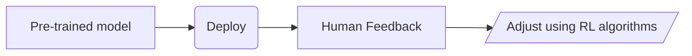

# Intro to LLM

- they are neural networks that have billions of parameters.
- they are trained on a large dataset of text.

- they predict the next word output, this is called "self-supervised learning".

- Based on transformer architecture, which is a special type of neural network.(Attention is all you need)

- self attention mechanism, basically allow the model to weight the important of each word relative to the other words in the sentence.

## Pre-trained models

- Models that have been trained on a large dataset of text.

- Primary goal is not to train on specific dataset, but to expose to as much data as possible.

- It requires extensive compute resources; gpt-3 required 3.2M USD

### providers:

= GOogle:
    - Google CLoud, TensorFlow Hub (Bert, Albert, Palm, etc.)
    - Open source: Hugging Face.
    - Openai: Through OpenAI API.

## Fine Tuning Models:

- Adjusting the parameters of pre-trained models to make it better suited for a specific task.

## Needs of Fine Tuning Models:

- Pre-trained do not perform well on specific usecases, they are not familiar with jargons, the specific structures of specific domains.

- Fine tuning model on specific dataset related to domain, makes it familiar with the domain, and the specific structures of the domain.

Also, fine tuning needs comparatively less data, and less compute resources.
E.g: fine tuning for medical domain, requires less data, and less compute resources than pre-training on a large dataset of text.

## Transfer Learning:
    - Fine tuning works on the concept of transfer learning.
    - IN transfer learning, features learned on one problem, can be leveraged on new, similar problem

Note:
    - fine tuning is prone to overfitting, if the model is trained on too little data.
    - Models gets trained on seen data too good that it does not generalize well to unseen data.

## LLM Fine Tuning Flow:

1. Choose a pre-trained model.
2. Choose a dataset related to the domain of the model.
3. Train the model on the dataset.
4. Evaluate the model on the dataset.
5. Fine tune the model on the dataset.
6. Evaluate the model on the dataset.
7. Deploy the model.
8. Monitor the model.
9. Fine tune the model on the dataset.
10. Evaluate the model on the dataset.
11. Deploy the model.
12. Monitor the model.

## consideration of LLM Model:
    - Model Size
    - Checkpoint(Specific checkpoints of model params)
    - Task Alignment (A pre-trained model on domain specific dataset can be a good starting point.)
    - Computational resources and cost
    - Open souce vs commercials

- Freeze the earlier layers of the model, and train the later layers. Basically, model know basics of language, and we are training it to know the specific domain.

## Types of fine tuning

### Full fine tuning

- Train the entire model on the dataset.
- Unfreeze all the layers of the model.
- **Benefit:** Suitable method of fine-tuning when the task differs significantly from the pre-training objectives.
- **Considerations:** Requires more data, and more compute resources.
- **Disadvantage:** Can lead to catastrophic forgetting, where the model forgets the pre-training objectives.

### Sequential fine tuning

- A pre-trained model is fine-tuned in a **sequential manner** on different tasks or domains.
- For example - Fine-tune a general LLM to medical language and then to cardiology.

### Layer-wise fine tuning

- Tweak the layers of a LLM at **varying rates**.
- The **task specific layers are tweaked**, and the generic information ones are kept as it is.

### Feature extraction fine tuning

- Only the **final layers are tweaked** and the early layers remain frozen.
- Recommended when the new task is in lines with the pre-trained model.

### Instruction fine tuning

- Supervised learning that uses labeled data in **instructions format**.
- **Dataset comprises of instructional prompts** with corresponding outputs to teach the model how to behave to certain inputs.
- Recommended to fine tune **OpenAI GPT models**.

### RLHF fine tuning

- RLHF — Reinforcement learning from human feedback.
- Integrates reinforcement learning principles with human feedback to improve LLM performance.

#### RLHF process flow

Common techniques include reward modeling, PPO (Proximal Policy Optimization), comparative ranking, preference learning, etc.

### PEFT fine tuning

- **PEFT** — Parameter Efficient Fine Tuning.
- A set of techniques **to minimize the computational resources** and time required for fine-tuning.
- Focuses on updating only a **small number** of parameters.
- Mitigates the **catastrophic forgetting** problem.

### LoRA fine tuning

- LoRA — Low-Rank Adaptation.
- **Adaptors** are small, trainable modules inserted between the pre-trained layers and only these new parameters are trained without much changes in its original parameters.
- LoRA transforms the adapter into an **optimized decomposition** and subsequently **lowers the rank of these matrices.**
- Zero trade-off in performance, Low memory footprint, Faster training and inference, Multimodal deployments.

### QLoRA fine tuning

- QLoRA — Quantized Low-Rank Adaptation.
- Works on top of LoRA by additionally **quantizing the weights** of the LoRA adapters to lower precision (4-bit instead of 8-bit).
- Quantization makes it even **more memory efficient** than LoRA.

## Notes

- The usual training size of LLM fine tuning is megabytes of data.
- When fine-tuning a model, you typically want to preserve the learned features at the earlier layers, which capture basic, general patterns, while allowing the later layers to be adjusted for the specific task at hand.